# Projeto Echos Beta

**Sistema web para gerenciamento de laudos veterinários, desenvolvido em Django.**

## 📌 Visão Geral

O **Projeto Echos Beta** foi criado para facilitar o gerenciamento de exames e laudos em clínicas veterinárias. Ele permite o cadastro de tutores, pacientes, veterinários e clínicas, além da geração e organização de laudos médicos.

## OBS:

Este projeto nasceu da necessidade de um sistema mais completo para a empresa de laudos veterinários que administro com minha esposa. No início, eu não tinha conhecimento em programação, mas acreditava que seria possível desenvolver uma solução própria. Por isso, comecei a estudar na Alura (minhas formações estão no LinkedIn: [meu perfil](https://www.linkedin.com/in/anderson-cavalcante-bem-92bb48268/)).

O projeto foi, ao mesmo tempo, um exercício de aprendizado e a base do sistema que utilizamos atualmente. Embora o código possa não seguir todas as melhores práticas, ele reflete minha evolução como desenvolvedor. Algumas bibliotecas instaladas não foram utilizadas, e os templates poderiam estar mais organizados, mas o sistema é funcional e atende às necessidades da empresa.

Postei este repositório como parte do meu portfólio, mostrando tanto o resultado prático quanto minha trajetória de aprendizado.


## 🚀 Funcionalidades

- 🏥 **Cadastro e gerenciamento** de tutores, pacientes, veterinários e clínicas
- 📄 **Criação e gestão** de laudos veterinários
- 📅 **Agendamentos e envios programados** de laudos
- 🔍 **Busca e filtros avançados** para facilitar a navegação
- 📊 **Relatórios e projeções financeiras**
- 🔄 **Backup e restauração** dos dados

## 🛠️ Tecnologias Utilizadas

- **Back-end:** Django (Python)
- **Front-end:** HTML, CSS, Bootstrap
- **Banco de Dados:** SQLite (padrão) ou PostgreSQL (opcional)
- **Geração de PDFs:** WeasyPrint


## 📷 Capturas de Tela

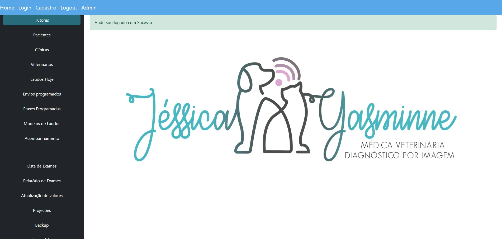


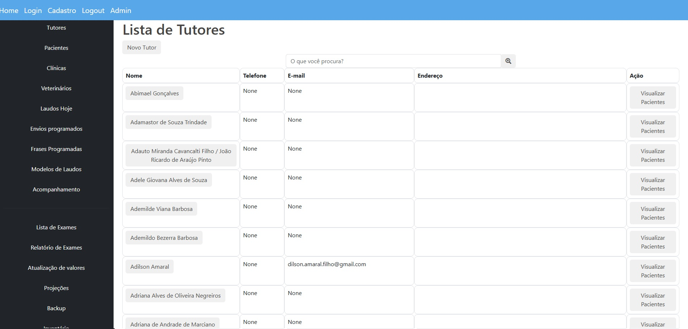


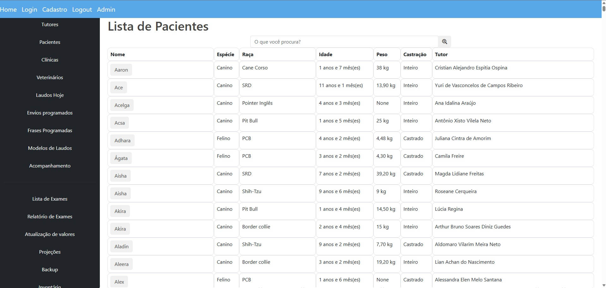


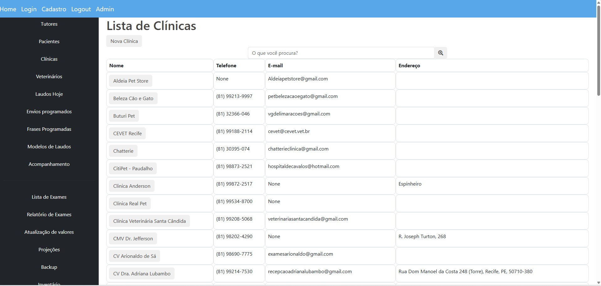


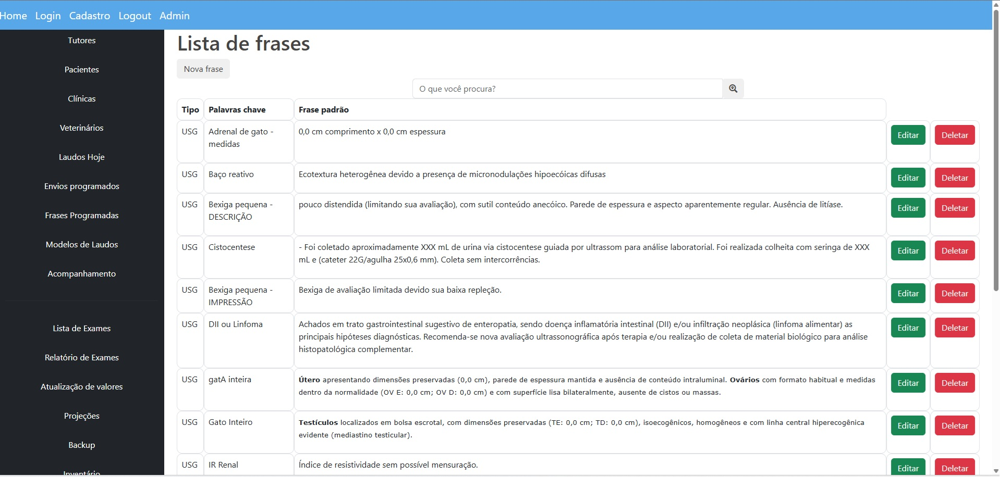


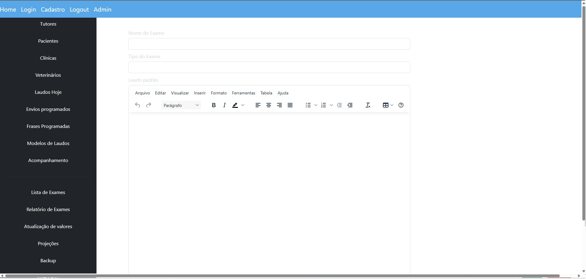

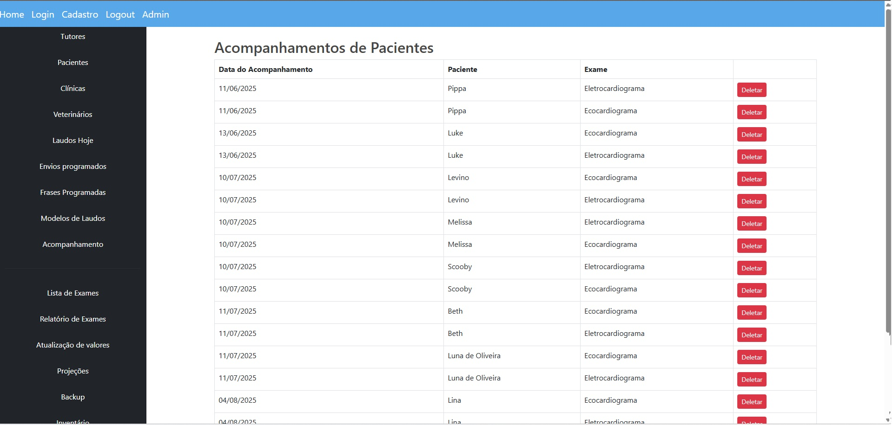

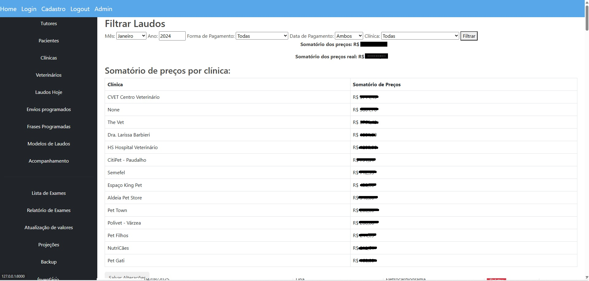
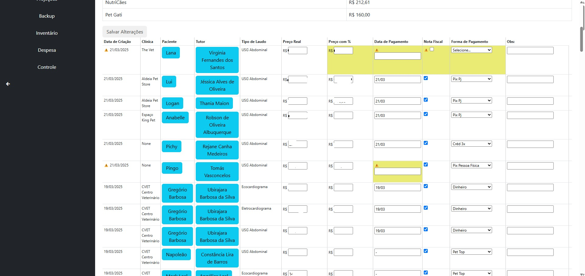

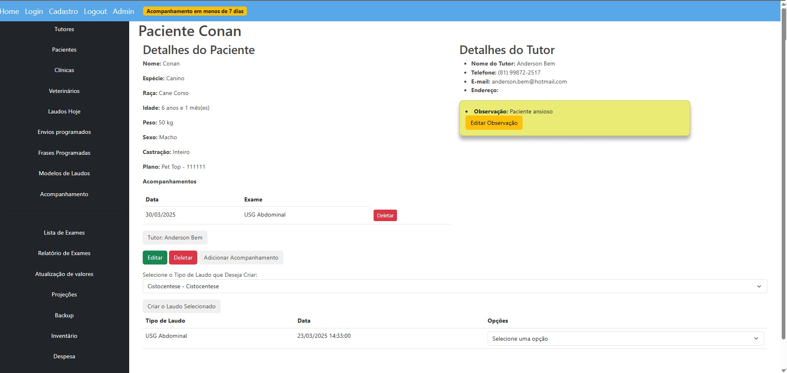
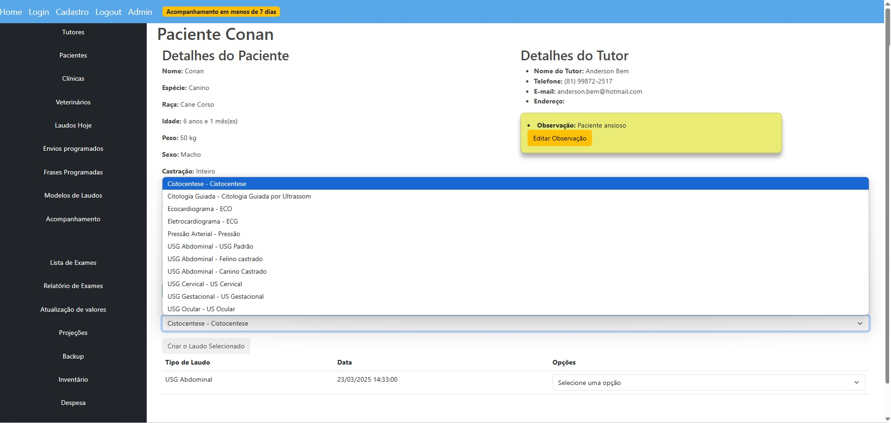
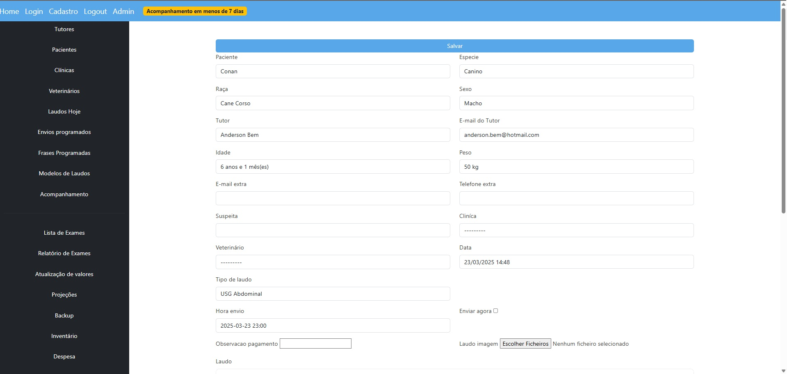
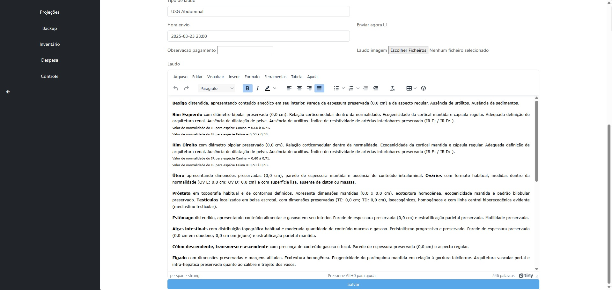
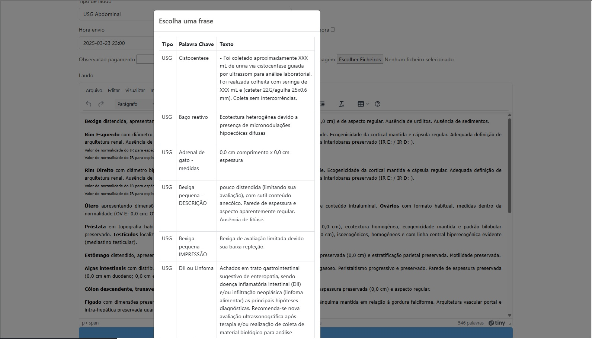


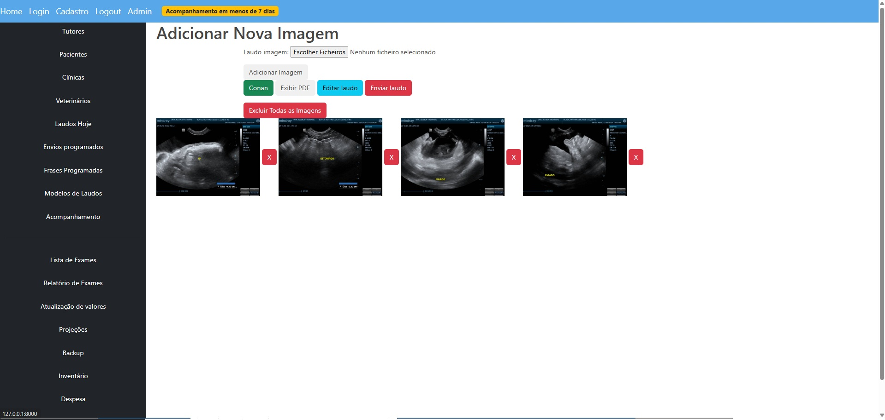
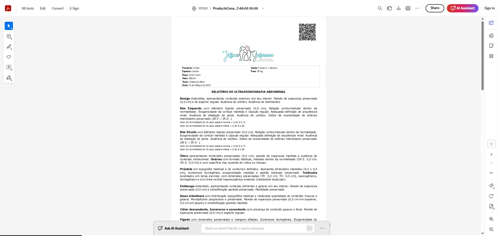

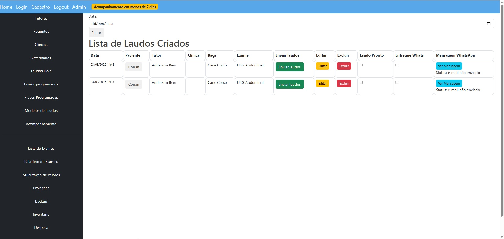

## 📜 Licença

Este projeto é de código aberto e está disponível sob a licença MIT.

---
Desenvolvido por [AndersonBem](https://github.com/AndersonBem).
```

Agora você pode copiar e usar diretamente.
